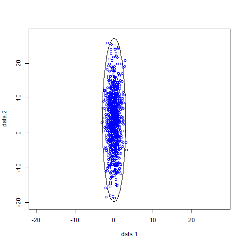

## Introduction

- Goal

-- Generate a desinated number of two-dimensional samples with Gaussian distribution

-- Rotate the samples with a desinated angle

-- Be emcompassed by an ellipse

--- .class #id 

## Mathematical formula
- The multivariate Gaussian distribution

-- PDF: $p(\mathbf{x})=(2\pi)^{-\frac{k}{2}}|\Sigma|^{-\frac{1}{2}}e^{-\frac{1}{2}(\mathbf{x}-\mathbf{\mu})^{t} {\Sigma}^{-1}(\mathbf{x}-\mathbf{\mu})}$

- Formula of rotation with the angle $\theta$

Suppose the orignial sample is at $(x,y)$, after rotation with $\theta$ degree, the new sample $(x',y')$ is at 

$x'=x\times{\cos(\theta)}+y\times{\sin(\theta)}$, 

$y'=-x\times{\sin(\theta)}+y\times{\cos(\theta)}$

---

## Sample before rotation

- Original Samples

 

---

## Sample After rotation

- Sample after rotation 90 degree

 

